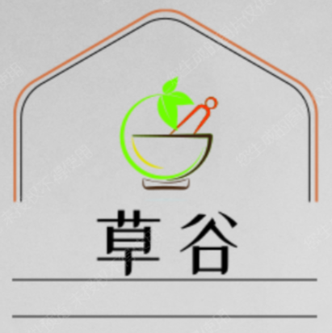

# ChineseHerbalMedicinePromotionPlatform
2023中国计算机设计大赛作品
<h1>智能中草药推广平台</h1>

### 介绍
中药材指中医指导应用的原生药材，用于治疗疾病。根据不同的标准，中药材有多种分类方式，目前主要是根据采收原则分为植物类、动物类和矿物类。植物类又可以细分为根茎类、果实籽仁类、全草类、树皮类等。
本项目立足于中草药数据收集，文化拓展宣传，将现代互联网信息文化与传统中医药相结合，通过现代化信息媒介宣传推广中医药文化，并为现社会中医学习者提供帮助。

### 设计方案

 
项目主体采用前后端分离，前端使用Vue作为系统社区界面设计，使用Echarts关系图做草药数据的展示。

服务端使用微服务架构思想，进行业务拆分，通过微服务远程调用将多服务串联起来，使用jikens配合docker差价进行快速部署。
服务端数据使用Mysql与Neo4j进行储存，mysql存储社区基本用户信息及，内容，用户评论等信息，Neo4j储存草药门类等数据，以图的形式存储，便于web端Echarts关系图的展示，以及草药信息的新增修改操作。
### 软件架构
软件架构说明
服务端：springcloud，springboot，jwt，mysql，neo4j
客户端：vue，ecahers，elementui等前端

### 特色
<ul>
<li>
 1.
社区基本功能：将草药的展示方式，从传统的书籍影像转移至论坛贴吧中。增加用户的互动性与趣味性，并在用户交流互动中进行信息的沉淀积累.
</li>
<li>
 2.
知识图谱：通过图谱形式串联单一的中药，形成直观复合思维的数据展示形式，结构化的知识，天然的把领域知识做了显性化沉淀和关联。构建起来了一张图。
</li>
<li>
 3.
智能问答：使用百度智能云Unit问答系统，通过构建应答模型，完成知识库构建，可以在海量知识数据库快速检索所需数据，增加知识获取效率，并提高用户与系统的互动性
</li>
<li>
 3.
中草药OCR识别：使用Opencv与百度EasyDL技术构建中草药识别模型，与手机拍摄图像比较，获取对应植物种类，通过植物种类在知识库检索，获得相应信息。
</li>
</ul>

### 详细设计
#### 网关服务
接收所有进入平台的请求，并通过Spring Cloud Gateway转发到对应的微服务。网关服务还负责安全认证、限流和熔断等操作。
#### 中草药知识库服务 Herb Knowledge Service
提供中草药知识库相关的查询和管理功能。该服务通过Nacos进行注册和配置管理，服务提供者在启动时向Nacos注册自己的实例信息，服务消费者从Nacos中获取服务提供者的实例信息，并通过Feign客户端来调用服务。
#### 中草药产品服务 Herb Product Service
提供中草药产品相关的查询和管理功能。该服务通过Nacos进行注册和配置管理，服务提供者在启动时向Nacos注册自己的实例信息，服务消费者从Nacos中获取服务提供者的实例信息，并通过Feign客户端来调用服务。
#### 中草药配方推荐服务 Herb Formula Service
提供中草药配方推荐相关的算法和查询功能。该服务通过Nacos进行注册和配置管理，服务提供者在启动时向Nacos注册自己的实例信息，服务消费者从Nacos中获取服务提供者的实例信息，并通过Feign客户端来调用服务。
#### 中草药专家咨询服务 Herb Consultation Service
提供中草药专家咨询相关的查询和管理功能。该服务通过Nacos进行注册和配置管理，服务提供者在启动时向Nacos注册自己的实例信息，服务消费者从Nacos中获取服务提供者的实例信息，并通过Feign客户端来调用服务。
#### 中草药社区服务 Herb Community Service
提供中草药社区相关的查询和管理功能。该服务通过Nacos进行注册和配置管理，服务提供者在启动时向Nacos注册自己的实例信息，服务消费者从Nacos中获取服务提供者的实例信息，并通过Feign客户端来调用服务。
#### 单点登录服务 User Center Service
sso需要一个独立的认证中心，所有子系统都通过认证中心的登录入口进行登录，登录时带上自己的地址，子系统只接受认证中心的授权，授权通过令牌（token）实现，sso认证中心验证用户的用户名密码正确，创建全局会话和token，token作为参数发送给各个子系统，子系统拿到token，即得到了授权，可以借此创建局部会话，局部会话登录方式与单系统的登录方式相同。
### 系统特色
#### 架构设计
采用微服务架构设计，将不同的功能模块划分为不同的微服务，通过Spring Cloud技术栈实现微服务之间的调用和管理。
使用Nacos作为服务注册中心和配置中心，实现服务的自动发现、负载均衡和配置管理。
使用Redis作为缓存，提高数据访问速度和服务响应速度。
使用Elasticsearch作为搜索引擎，提供高效的搜索服务和数据分析能力。
使用Kafka作为消息队列，实现异步处理和解耦。
#### 高可用设计
在Nacos、Redis、Elasticsearch和Kafka等关键组件上进行集群部署，确保服务的高可用性和可扩展性。
使用Spring Cloud Gateway实现服务网关，实现请求的路由、限流、熔断和安全认证等操作，确保服务的稳定性和安全性。
在每个微服务内部使用负载均衡策略，分发请求到多个实例上，避免单点故障和服务不可用。
#### 创意设计
在中草药知识库服务中，使用机器学习技术对中草药的特性、功效和用途进行分析和预测，提供更加准确和全面的中草药知识库。
在中草药产品服务中，使用图像识别技术对中草药产品进行识别和分类，实现智能化的产品管理和推荐。
在中草药配方推荐服务中，使用协同过滤算法对用户的健康状况、症状和喜好等信息进行分析和匹配，实现个性化的中草药配方推荐。
在中草药社区服务中，引入社交网络和内容推荐算法，实现用户之间的互动和知识分享，提高用户粘性和活跃度。

